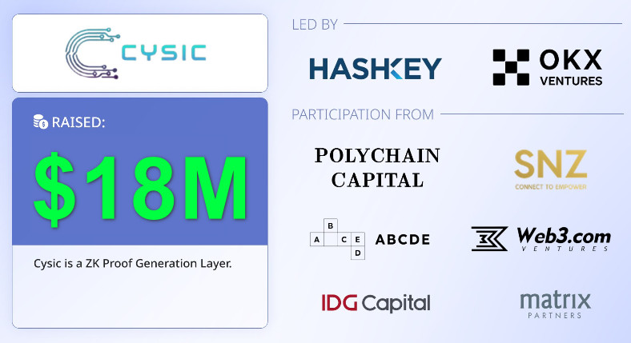

<h2 align=center>Cysic Testnet Verifier Guide</h2>


<p align="center">

</p>


## Submit your application
- Visit : [this website](https://testnet.cysic.xyz/m/register)
- Click the “𝗖𝗼𝗻𝗻𝗲𝗰𝘁 𝗪𝗮𝗹𝗹𝗲𝘁” button, and confirm the connection.
- After connecting your wallet, please select the “𝗩𝗲𝗿𝗶𝗳𝗶𝗲𝗿” button.
- Submit your information and then click “𝗖𝗼𝗻𝗳𝗶𝗿𝗺”, sign this then wait for the backend confirmation.
## Check submission status
- Check whether your address is accepted or not on Cysic Dashboard : [here](https://testnet.cysic.xyz/m/dashboard/verifier)
- If you see "accept" then follow the below procedure


## System Specifications

| Component  | Specification |
|------------|---------------|
| **CPU**    | Single Core   |
| **Memory** | 512 MB        |
| **Disk**   | 10 GB         |
| **Bandwidth** | 100 KB/s   |

## One Click Guide

- Use the below command on Linux based system
```bash
[ -f "cysic.sh" ] && rm cysic.sh; wget -q https://raw.githubusercontent.com/BidyutRoy2/Cysic-Testnet-Verified/main/cysic.sh && chmod +x cysic.sh && ./cysic.sh
```

## Checking Logs

- **Each time u will check logs, make sure to detach from screen session everytime using `Ctrl` + `A` + `D`**
- To view logs use this command
```bash
screen -r cysic
```
- It will keep downloading some files, will take 40-50 mins to dowload, you can close this terminal but before that make sure to **detach from current screen session using `Ctrl` + `A` + `D`**
- After that, when u check again after 1 hr or 2 hr, u will see logs something like this, It means it is working fine


- Also you can check your points [here](https://testnet.cysic.xyz/m/dashboard/)

## Cysic Survey2Earn- Testnet Feedback Fill Form [HERE](https://docs.google.com/forms/d/e/1FAIpQLSc5bNr3VCqfjFoool9uttLP5naM0eNqDwzlCxIY_SwpylHBNA/viewform)
